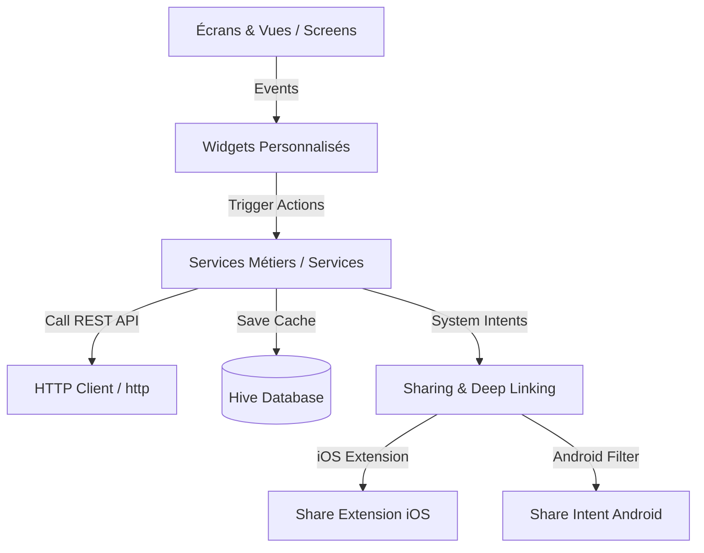

# Document de Spécifications et Documentation Technique - Cooked Mobile App

Ce document présente l'architecture complète, les services, les configurations multiplateformes (iOS/Android) et les correctifs techniques du projet mobile **Cooked** développé en **Flutter**.

---

## 1. Vue d'ensemble de l'Architecture Mobile

L'application mobile Cooked est développée avec le SDK **Flutter 3.x**. L'architecture sépare clairement l'interface utilisateur, les widgets réutilisables et les services métiers (Communication API, Base de données, etc.).



### Stack Technique Mobile :
* **Framework principal** : Flutter / Dart
* **Persistance locale** : Hive NoSQL Database (cache JSON des requêtes avec Time-to-Live)
* **Design & UI** : Style et thèmes personnalisés, adaptation responsive via `flutter_screenutil`
* **Mise en cache média** : `cached_network_image`
* **Intégrations système** : `receive_sharing_intent`, `in_app_purchase`, `google_sign_in`, `sign_in_with_apple`
* **Crash & Analytics** : Firebase (Analytics, Crashlytics, Performance)

---

## 2. Services Applicatifs Clés

### A. Base de Données Locale & Cache (`DatabaseService.dart`)
L'application utilise **Hive** comme base NoSQL légère pour mettre en cache les requêtes de l'API.
* **Mise en cache intelligente** : Les données API lourdes (liste de recettes, écran Home) sont sérialisées en JSON et enregistrées avec un horodatage.
* **Gestion du TTL (Time-To-Live)** : Lors de la lecture du cache, si la durée de validité (TTL) est dépassée, le cache est invalidé et supprimé automatiquement, déclenchant un nouvel appel réseau. Cela assure un mode hors-ligne irréprochable.

### B. Système de Partage et d'Importation (`SharingService.dart`)
Le partage est l'un des moteurs principaux de l'application (importation de recettes depuis TikTok, YouTube, Instagram, etc.).
* **Partage Inter-app (Intent sharing)** : L'application écoute les flux partagés via le package `receive_sharing_intent`.
* **Deep Linking (`app_links`)** : Redirection des liens système vers l'application principale via les schémas d'URL configurés.

### C. Authentification (`AuthService.dart`)
* **Standard** : Email/Mot de passe avec authentification forte et validation par OTP.
* **Sociale** : Connexion unifiée avec Apple (sur iOS) et Google (iOS/Android) en envoyant les Jetons d'ID au backend pour vérification cryptographique.

### D. Achats In-App (`in_app_purchase`)
* Gère l'affichage du Paywall, l'initialisation des produits App Store et Google Play, le traitement des paiements et la transmission des reçus d'achat au backend pour validation.

---

## 3. Configuration Spécifique iOS & Android

### 📱 Spécificités iOS (App Extensions)
1. **Share Extension (`ShareExtension`)** :
   * Une cible native Swift a été ajoutée au projet Xcode pour afficher Cooked dans le menu de partage natif d'iOS.
   * La configuration de `NSExtensionActivationRule` dans `Info.plist` de l'extension accepte les fichiers, images, vidéos, textes et URL pour gérer les partages complexes (comme TikTok).
2. **App Groups (`group.com.cookedapp.app`)** :
   * Activé sur la cible principale `Runner` et sur `ShareExtension`.
   * Permet à l'extension d'écrire des données dans un conteneur partagé accessible par l'application principale lorsque l'application s'ouvre.
3. **Schéma d'URL et Deep Linking** :
   * Ajout du schéma `ShareMedia-com.cookedapp.app` dans `Runner/Info.plist` pour permettre à l'extension de réveiller l'application principale après le partage.
4. **Xcode Build Phases (Embed Phase)** :
   * Ajout de la phase `Embed App Extensions` dans le projet Xcode (`project.pbxproj`) pour garantir que `ShareExtension.appex` soit correctement empaqueté et signé dans l'application finale envoyée sur TestFlight.

### 🤖 Spécificités Android
1. **Intent Filters (`AndroidManifest.xml`)** :
   * Configuration de filtres d'action de partage (`SEND` et `SEND_MULTIPLE`) acceptant les types MIME `text/plain`, `image/*` et `video/*`.
2. **Deep Linking** :
   * Enregistrement du schéma de l'application et de l'association d'application via les fichiers `assetlinks.json`.

---

## 4. Télémétrie et Résilience aux Crashs

L'application intègre **Firebase Crashlytics** pour enregistrer en production tous les crashs matériels et les erreurs Dart :
* Les erreurs de framework Flutter fatales sont attrapées via `FlutterError.onError = FirebaseCrashlytics.instance.recordFlutterFatalError`.
* Les erreurs asynchrones hors-framework sont capturées via le dispatcher global :
  ```dart
  PlatformDispatcher.instance.onError = (error, stack) {
    FirebaseCrashlytics.instance.recordError(error, stack, fatal: true);
    return true;
  };
  ```

---

## 5. Comment compiler et tester en local

### Prérequis
* Flutter SDK (Version compatible avec le SDK constraint `^3.8.1`).
* Xcode 15+ (pour compiler la version iOS).
* Android Studio (pour compiler la version Android).

### Commandes utiles
1. **Récupérer les dépendances** :
   ```bash
   flutter pub get
   ```
2. **Lancer la génération de code** (pour build_runner) :
   ```bash
   flutter pub run build_runner build --delete-conflicting-outputs
   ```
3. **Lancer l'application en mode développement** :
   ```bash
   flutter run
   ```
4. **Générer le bundle iOS pour archive** :
   ```bash
   flutter build ipa --release
   ```
